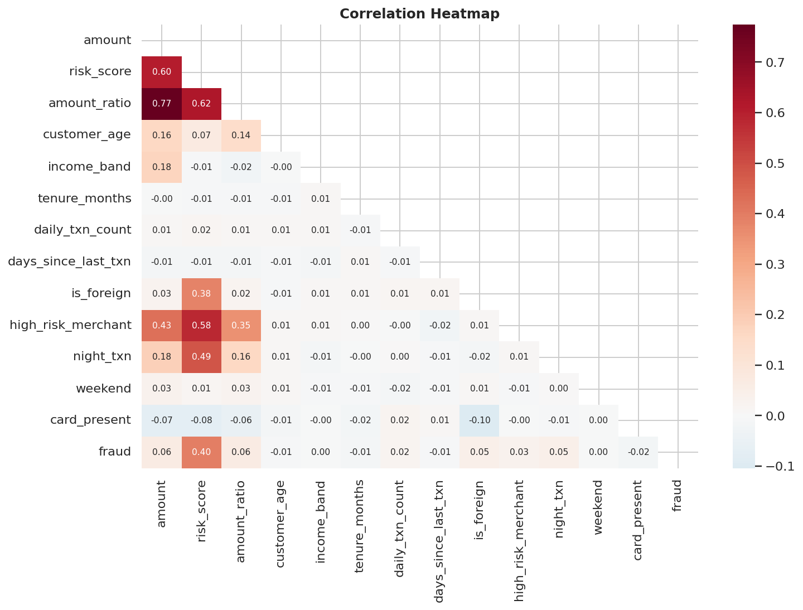
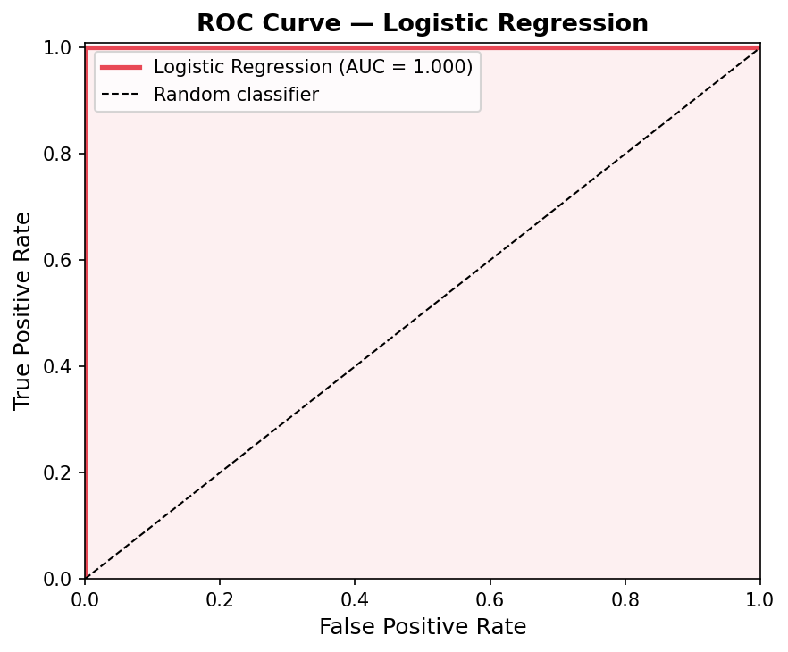
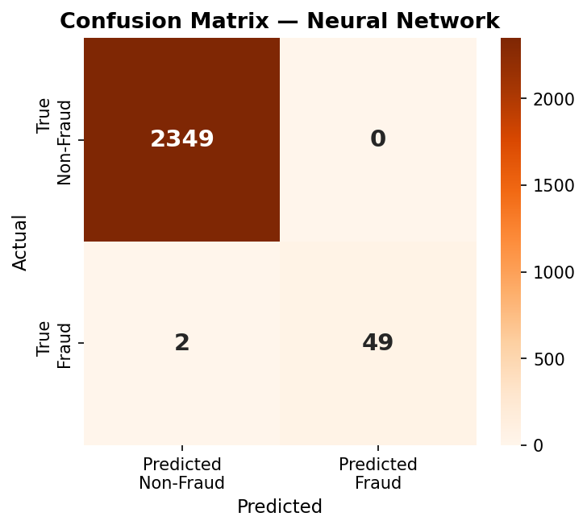

# Fraud Detection using Machine Learning

An end-to-end fraud detection project that develops and compares statistical and machine learning models for identifying fraudulent financial transactions using Python.

---

## Overview

Fraud detection is a highly imbalanced binary classification problem where fraudulent transactions represent only a small fraction of all observations. This project develops a complete analytical pipeline, from data preprocessing and exploratory analysis to predictive modelling and performance evaluation.

Both classical statistical models and machine learning techniques are implemented and compared to assess their effectiveness in identifying fraudulent transactions.

## Project Summary

| Attribute | Value |
|-----------|-------|
| Domain | Fraud Detection |
| Dataset | Synthetic Financial Transactions |
| Observations | 12,000 |
| Features | 24 |
| Fraud Rate | 2.13% |
| Models | Linear Regression, Logistic Regression, MLP, Autoencoder |
| Language | Python |

## Objectives

- Develop an end-to-end fraud detection pipeline.
- Compare statistical and machine learning approaches for fraud detection.
- Evaluate predictive performance using metrics suitable for imbalanced classification.
- Identify the main factors associated with fraudulent transactions.

## Dataset

The analysis uses a synthetic financial transactions dataset containing:

- 12,000 observations
- 24 variables
- Fraud rate of 2.13%

The dataset includes customer characteristics, transaction attributes, behavioural indicators and a binary fraud label.

## Methodology

The project follows the workflow below:

1. Data preprocessing
2. Missing value imputation
3. Exploratory Data Analysis (EDA)
4. Feature engineering
5. Model development
6. Model evaluation
7. Performance comparison

## Models

The following predictive models were implemented:

- Linear Regression
- Logistic Regression
- Multilayer Perceptron (MLP)
- Autoencoder

## Evaluation Metrics

Model performance was assessed using:

- Precision
- Recall
- F1-score
- ROC-AUC

Special emphasis was placed on metrics appropriate for highly imbalanced classification problems.

## Results

The analysis identified several important fraud indicators, including customer risk score, transaction amount ratio, foreign transactions, night transactions and high-risk merchants.

The supervised models achieved excellent predictive performance, while the autoencoder demonstrated the applicability of unsupervised anomaly detection techniques.

The following figures present selected visualizations from the exploratory analysis and model evaluation.

## Technologies

- Python
- pandas
- NumPy
- scikit-learn
- Matplotlib

## Repository Structure

```text
fraud-detection-machine-learning/
│
├── data/
├── notebooks/
├── src/
├── results/
├── report/
└── README.md
```

## Repository Contents

| Folder | Description |
|----------|-------------|
| data | Dataset used in the analysis |
| notebooks | Jupyter notebooks |
| src | Python source code |
| results | Figures and model outputs |
| report | Final project report |

## Key Visualizations

### Correlation Heatmap



### ROC Curve



### Confusion Matrix



## Author

**Konstantinos Papavrontos**

MSc Candidate in Business Economics with Analytics  
Athens University of Economics and Business
